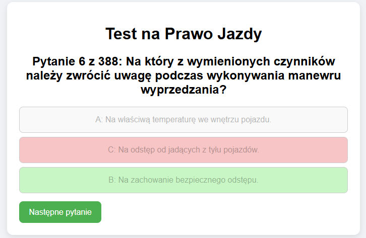

# Driver's tests 

Driver's tests is a small app for practicing before taking the driver's theoretical exam in Poland (B vehicle category).
It works as a locally run HTML file backed with JavaScript and a friendly user interface in CSS. The application's language is Polish.


## Features 

- Displaying random questions from the prepared question base
- Fetching JSON-formatted questions into the  app
- User-friendly design

## Screenshots 

 

## Installation 

First, copy the repository or download it as a zip and extract. 
Enter `drivtest` directory.


How to run:

### 1. Using Python:

Open PowerShell in your project folder.
For Python 3, run:
```bash
python -m http.server 8000
```
Then open your browser and go to:
```bash
http://localhost:8000/drivtest.html
```
### 2. Using Node.js:

Install http-server globally (only once):
```bash
npm install -g http-server
```
Start the server: 
```bash
npm install -g http-server
```
Open:
```bash
http://localhost:8000/drivtest.html
```
